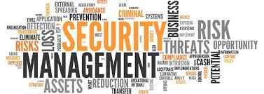
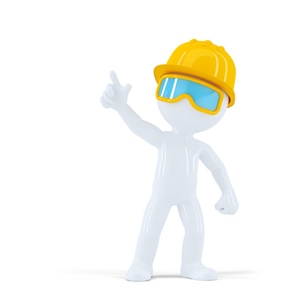
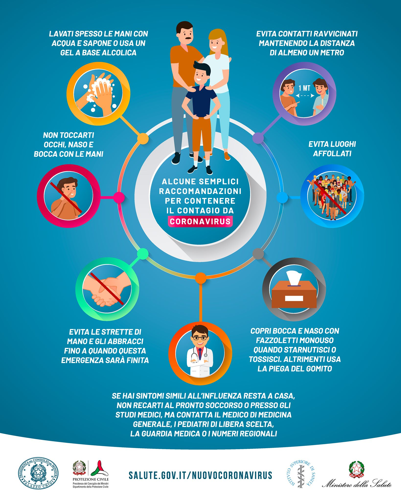
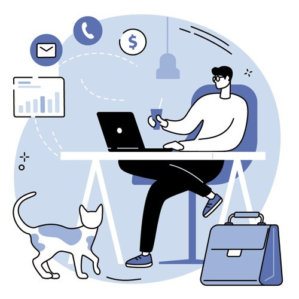
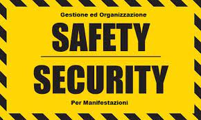
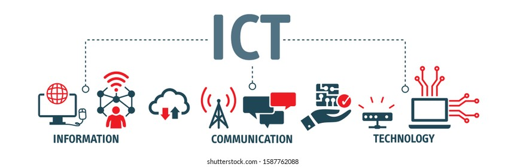

# Il Lavoro ai tempi della Pandemia

 

## Concetto di Misura di Prevenzione
____________________________________

Il complesso di disposizione è misure atte ad evitare l'insorgere
dei rischi o limitarne gli effetti viene definito Misure di Prevenzione

In termini di normativa **l'articolo 15 del D.le 81/08** definisce il concetto
di **informazione**, **formazione** e **addestramento**, attività atte a ridurre i rischi.

|Per formazione si intende|
|:-----------------------:|

 - Un processo educativo volto a trasferire ai lavoratori ed a altri soggetti del servizio di prevenzione rischi specifiche conoscenze e procedure utili all'acquisizione di competenze utili alla riduzione di rischi sul luogo di lavoro

|Per informazione si intende|
|:-------------------------:|

 L'attività volta a fornire conoscenze utili all'identificazione, riduzione e gestione dei rischi negli ambienti lavorativi

|Per addestramento si intende invece|
|:---------------------------------:|

Quell'insieme di attività volta a far apprende nell'atto pratico delle competenze utili alla prevenzione dei rischi come ad esempio: L'uso coretto dei DPI e l'uso coretto dell'attrezzatura di lavoro *(MACCHINE, IMPIANTI ETC...)*  L'addestramento riveste quindi la parte pratica delle attività di formazioni

## Obblighi del Datore di Lavora
____________________________________

In base **all'articolo 74 del D.l 81/08** il datore di lavoro deve assicurare ad ogni dipendente in funzione
del ruolo svolto un adeguata formazione in materia di salute e sicurezza sul luogo del lavoro.

Tutta l'attività di formazione e informazione deve essere erogata dal datore di lavoro(OBBLIGATORIAMENTE) entro i **60 gg.** dall'assunzione e aggiornate periodicamente secondo appositi corsi di formazione e addestramento.

## Modalità di erogazione dell'informazione (anche al tempo della Pandemia):
----------------------------

- Tradizionale :point_right: Formazione in Aula
- E-Learning :point_right: Modello formativo a distanza utilizzato ad oggi a causa della pandemia
 - Autoapprendimento sincrono *(c'è interazione tra le parti)*
 - Autoapprendimento asincrono *(non c'è interazione tra le parti)*

## Nuovo Protocollo di regolazione per le misure di contrasto e contenimento della pandemia COVID-19
____________________________________

|Informazione|
|:----------:|

E obbligo ed incarico del datore di lavoro di informare in modo adeguato tutti i dipendenti e visitatori della strutturain materia delle disposizioni dettate dalle autorità con le dovute modalità. E' obbligo inoltre affiggere nei luoghi adeguati cartelloni o depilane informativi in merito alle misure di contenimento.
L'azienda inoltre deve fornire una informazione particolare per ogni attività lavorativa nel complesso delle misure adottate per il contrasto al virusCOVID-19. Ogni membro del personale è tenuto per tanto a conoscere e attuare con puntualità quanto comunicato durante le attività di informazione. Sopratutto in materia dei Dispositivi di Protezione Individuali *(Mascherina e guanti o gel sanificante)*
Ogni azienda ha inoltre l'obbligo di informare e vigilare sui soggetti terzi che partecipano all'attività lavorativo in azienda (professionisti autonomi, aziende appaltatrici ecc...)

|La normativa in merito alla prevenzione e riduzione della diffusione del COVID 19 esemplifica|
|----------------------------------|
  <li>L'obbligo di stare a case in presenza di una temperatura corporea superiore a 37.5 gradi (febbre).   <li>Contattare le autorità mediche con tempestività per informa l'ASL di competenza della situazione.   <li>Segnalare in modo tempestivo al resposabile del luogo di lavoro qualora si presentassero sintomatologie note o sussista un pericolo di contagio(contatti con infetti esempio).  <li>Osservare le regole di distanziamento e igiene delle mani   <li>Segnalare ogni sintomatologie sospetta

*Anche il metodo competente prende parte al processo di informazione nell'ambito della sorveglianza sanitaria.*

|Formazione|
|-----------|
La normativa di contenimento prevede in tema di formazione a titolo cautelativo e preventivo di sospendere ogni tipo di attività di formazione in presenza prediligendo la modalità a distanza e dell'E-Learning. Le eventuali certificazioni che prevedono una scadenza nell'anno in corso subiscono una deroga fino che la situazione non si sarà stabilizzata.

## Nuove modalità Organizzative durante la pandemia
____________________________________________________

Le nuove modalità organizzative del lavoro e degli appositi spazi prevedono misure di turnazione dei dipendenti in funzione di una diminuzione del numero di occupanti che possono accogliere
le singole strutture.

per tanto La modalità di Lavoro Agile permette ai lavoratori di svolgere il proprio lavoro a distanza presso il proprio domicilio e non in azienda usufruendo degli adeguati mezzi informatici.

Il datore di lavoro deve inoltre incoraggiare i dipendenti all'utilizzo di mezzi di trasporto verso il luogo di lavoro che garantisca l'adeguato distanziamento(utilizzo di mezzi privati o appositi).
All'interno del sito aziendale invece gli spostamenti sono ridotti al minimo e tutte le attività in presenza sono ridotte al minimo al fine di evitare forme di aggregazione.

## Lavoro Agile e Smartworking
____________________________________
|Telelavoro|
|------------|

L'Accordo quadro europeo 2002 regola la normativa sul telelavoro in ambito europeo, nel 2004 invece nell'abito della normativa nazionale viene promulgato il **Testo Unico 81/04** che tratta tra le diverse tematiche del testo anche quella del telelavoro.
Il telelavoro consiste in vece in una attività lavorativa svolta al di fuori dei locali dell'impresa in modo continuativo e in accordo con gli orari dell'azienda.
In virtù del concetto di prestazione lavorativa continuativa  il datore e tutte le autorità competenti hanno un libero accesso al luogo scelto come luogo di lavoro dal dipendente per giudicarne l'idoneità in termini di salute e idoneità all'attività svolta. Il telelavoro pur svolgendo un'attività continuativa a distanza deve comunque recarsi quanto necessario sul posto di lavoro.

|Lavoro Agile|
|:----------:|

Esiste inoltre nell'ambito della normativa nazionale una legge speciale regolatrice in materia di lavoro agile. La legge in questione è la **numero 81 del 22 maggio 2017**.
Tale modalità prevede un accordo tra le parti quindi tra dipendente e datore di lavoro per svolgere alcune attività lavorative a distanza oltre a eventuali accordi di carattere sindacale.
La regolamentazione del lavoro agile è necessaria in quanto le prestazioni di lavoro non vengono svolte in modo continuativo e non esiste un preciso ambiente di lavoro definito all'esterno dell'azienda, per tanto non esistono nessun tipo di vincolo di luogo e d'orario per tanto il lavoratore può svolgere la propria attività anche al di fuori dell'orario lavorativo in ogni luogo che ritiene idoneo. E' previsto comunque che il lavoratore si rechi sul luogo di lavoro periodicamente.

L'attuale normativa emergenziale richiama in modo ampio il ricorso a modalità a distanza come modalità organizzativa per contrastare la pandemia.

## Modalità di svolgimento del lavoro agile
____________________________________

Il lavoro agile può essere svolto in due regimi: Ordinario e in deroga

Il lavoro agile svolto a regime ordinario permette di svolgere varie attività di lavoro in una modalità flessibile che si adatti il più possibili ai bisogno del lavoratore al fine di aumentare la produttività e agevolare la conciliazione tra vita privata e vita lavorativa (senza vincoli di luogo e di durata).

Il lavoro agile in deroga invece nasce dalla necessità dei datori di lavoro di tutelare i proprio dipendenti dai pericoli che la pandemia ha portato.
Per tanto il lavoro agile in deroga permette al datore di lavoro di modificare e adeguare il contratto di lavoro secondo le esigenze portate della pandemia **senza nessun tipo di accordo individuale tra le parti** in merito al tema del lavoro agile *(concessione del datore di lavoro)*.

Permane l'obbligo però del datore di lavoro di fornire tutte le informazioni(informato scritto o telematica) in merito ai rischi legati alla modalità di lavoro smartworking.

## Obblighi del datore di lavoro per modalità di lavoro agile dei dipendenti

|sayfty e security|
|:----------------|

Il primo obbligo a cui il datore di lavoro è chiamato a adempiere è garantire la **salute** *(sayfty)* e **sicurezza** *(security)* dei dipendenti che svolgono le attività in modalità agile.

|Informativa|
|:---------:|

Il secondo obbligo riguarda la distribuzione di una informativa in merito ai rischi dovuti alla modalità di lavoro particolare a tutti i telelavoratori (RISCHI GENERALI E SPECIFICI DELLA MANSIONE).

|Manutenzione degli apparati|
|--------|

Terzo obbligo del datore di lavoro è la responsabilità nella sicurezza e nel buon funzionamento degli apparati e strumenti tecnologici assegnati al lavoratore *(PC PORTATILE, CONNESIONE AL LUOGO DI LAVORO)*.

##

Il lavoratore deve rispettivamente adempiere ad una serie di Obblighi tra cui il primo e collaborare con il datore di lavoro per l'applicazione  corretta delle norme di prevenzione e contenimento del contagio.

Si sconsiglia sempre al lavoratore di non utilizzare dispositivi dotati di schermo (lucido ma anche opaco) in ambienti esterni con il fine di evitare eventuali riflessi dannosi per la vista.

Non si raccomanda neanche l'uso di smart device come tablet o smartphone. Le uniche attività consentite in ambienti esterni sono: la lettura di documenti cartacei o l'effettuazione di chiamata video-voce (VoIP) o telefoniche. Se svolta all'aperto tali attività si raccomanda di svolgere il lavoro in un luogo ombreggiato per ridurre l'esposizione ai raggi UV. Evitare inoltre aree non adeguate ove si trovano rifiuti, animali liberi etc...

Mantenere inoltre sempre un abbigliamento adeguato.
*(per dettagli vedere informativa INAIL)*

Nei luoghi al chiuso invece è importante tener conto che le prestazioni di lavoro non possono essere svolte in luoghi non abitabili, senza servizi igenici, impianti a norma e senza servizi igenici. In merito all'illuminazione di raccomanda un ambiente illuminato in modo naturale e non diretto. Allo stesso modo l'ambiente deve essere adeguatamente arieggiato. In presenza di una illuminazione artificiale e importante invece evitare situazioni di abbagliamenti garantendo una illuminazione uniforme degli ambienti.

*Il lavoratore mantiene comunque tutti i diritti in merito a danni o malattie derivate dalla mansione svolta.*
